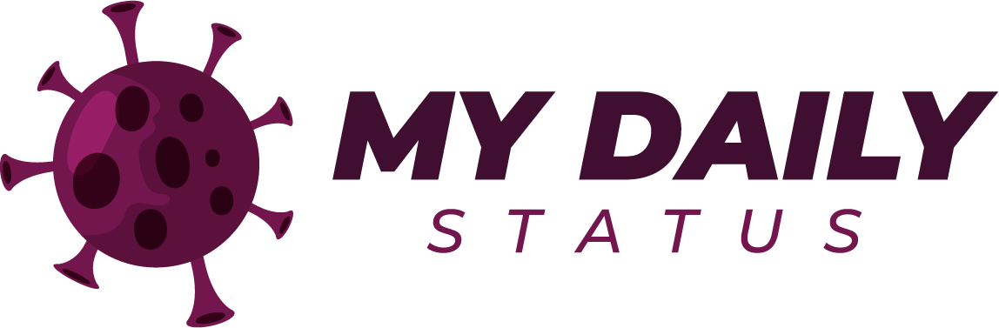

    

    Finalizado com sucesso o projeto "My Daily Status", desenvolvido durante a semana Fullstack Lab, organizado pelo pessoal do DevPleno. Na plataforma, um usuário pré-cadastrado pode fazer um registro periódico de seu estado de saúde durante esta pandemia que nos assola e acompanhar os registros de outros usuários ao seu redor. 

    Tecnologias Utilizadas:

    - Node.js
    - React.js
    - Next.js
    - Tailwind CSS
    - Auth0 Authentication
    - Firebase Database
    - Zeit

    #javascript #js #fullstack #nodejs #reactjs #nextjs
    #tailwindcss #auth0 #firebase #zeit #fullstacklab #devpleno

    

